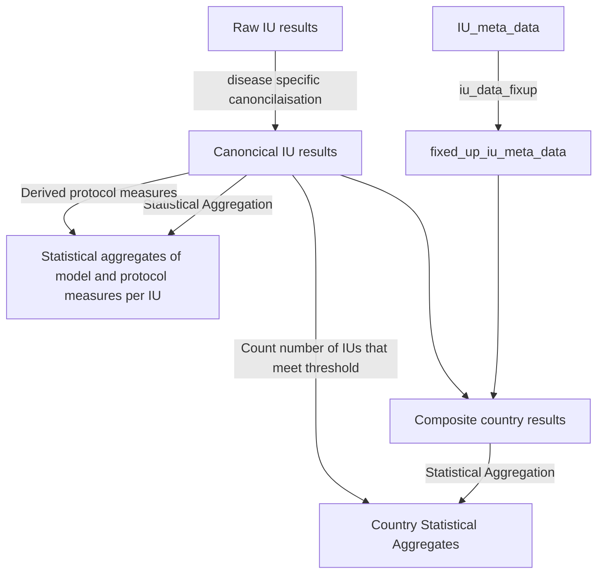

# endgame-postprocessing

## The Post Processing Pipeline

### Terminology

#### General
* **Processed prevalence** - the selected prevalence measure per model
* **Priority population** - the population of which the prevalence is a percentage of
* **Protocol passed** - whether the processed prevalence is below the disease specific threshold
* **Protocol Confidence** - the percentage of runs required to say the protocol has passed  
* **Model Measures** - the measures derived from the model, currently just processed prevalence
* **Protocol Measures** - the measures the post processing pipeline calculates, 
  currently each of the protocol confidence levels and whether enough simulations for that IU passed. 
* **IU Inclusion Criteria** - when counting up IUs for country aggregates (e.g. for working percentage of 
  IUs that meet the threshold for a given protocol confidence, or the total population of that country), 
  which IUs should be included.
* **Simulated IU** - an IU for which we have a set of simulated results for.

#### File Types
* **Raw** - the format that comes out of the model, multiple draws, many measures, non-standard names, per IU
* **Canonical Results** - Consistent names of columns across diseases, only showing processed prevalence
* **IU statistical aggregates** - multiple draws condensed into mean, median and percentiles, with columns for each protocol confidence on whether for that year the IU has passed the protocol
* **Composite Country Results** - the weighted assembling the draws for all the IUs still split out into multiple draws
* **Country statistical aggregates** - The composite draws for the country condensed into mean, median and percentiles, with columns for each protocol confidence whose values are _number_ of IUs that pass the protocol in the confidence percentage of runs.  

#### Disease Definitions

Currently Trachoma is not implemented.

| Disease | Priority population | Processed prevalence | Protocol Threshold | IU Inclusion Criteria |
| ------- | ------------------- | -------------------- | ------------------ | --------------------- |
| LF | $\geq 5$ Years Old | Sampled mf prevalence | $\leq 1$% | All IUs |
| Oncho | $\geq 5$ Years Old | True mf prevalence | $\leq 1$% | All IUs |
| STH | 5-15 Years Old | Prevalence SAC | $\leq 1$% or $\leq 10 $% | All IUs |
| Schisto | 5-15 Years Old | Prevalence SAC | $\leq 1$% or $\leq 10 $% | All IUs |




### The input specification

In general, inside the `input_directory` should be:

 - [PopulationMetadatafie.csv](#iu-meta-data-file)
 - scenario_1\
   - AAA\
     - AAA00001\
       - disease_specific_raw_file.csv
     - .. for each IU in country AAA, with 5 digit IU code
   - ... for each country ISO3 code
 - ... for each scenario

See below for disease specific specification:

#### Oncho

Expect file to be called:
`ihme-{IU_CODE}-{SCENARIO}-200_sims-mda_stop_2040-sampling_interval_1.0-raw_all_age_data.csv`

And have the following columns:

- `year_id`
- `age_start`
- `age_end`
- `measure`
- `draw_0`
- `draw_1`
- ... for each draw

We use the values whose measure is `prevalence`.

#### LF

Expect the file to be called: 
`ntdmc-{IU_CODE}-lf-{SCENARIO}-200.csv`

Have the following columns:

- `espen_loc`
- `year_id`
- `age_start`
- `age_end`
- `measure`
- `draw_0`
- `draw_1`
- .. for each draw

We use the values whose measure is `true mf prevalence (all pop)`

#### IU Meta Data File

This should include the following columns:

- IU_ID - the integer ID of the IU
- ADMIN0ISO3 - the ISO 3 character country code
- Priority_Population_Oncho
- Priority_Population_LF
- Endemecity_Oncho - the endemecity of Oncho (one of 'Endemic (under post-intervention surveillance)', 'Not reported', 'Endemic (pending IA)', 'Unknown (consider Oncho Elimination Mapping)', 'Unknown (under LF MDA)', 'Non-endemic', 'Endemic (MDA not delivered)', 'Endemic (under MDA)')
- Endemecity_LF - The endemecity of LF (one of 'Endemicity unknown', 'Endemic (under post-intervention surveillance)', 'Endemic (pending IA)', 'Not reported', 'Non-endemic', 'Endemic (MDA not delivered)', 'Endemic (under MDA)')

See [endemecity_classification.py](endgame_postprocessing/post_processing/endemicity_classification.py) for details of what are considered endemic.

Each row should correspond to a single IU. 

### The output specification:

#### Directory structure:

 - {disease}/
   - aggregated/
     - combined-{disease}-iu-lvl-agg.csv (concatenation of [the per IU file](#per-iu--combined-iu-level-file-))
     - [combined-{disease}-country-lvl-agg.csv](#country-statistical-aggregates)
     - [combined-{disease}-africa-lvl-agg.csv](#africa-statistical-aggregates)
   - ius/
     - [{scenario_N}\_{IU code}\_post_processed.csv](#per-iu--combined-iu-level-file-)
     - ... for each IU, for each scenario
   - iu_metadata.csv
   - aggregation_info.json
 - ... for each disease

#### File Contents

##### Per IU / combined IU level file :

###### Columns

- scenario
- country_code
- iu_name
- year_id
- measure
- mean
- X_percentile [2.5%, 5%, 10%, 25%, 50%, 75%, 90%, 95%, 97.5%]
- standard_deviation
- median

###### Measures

* **processed_prevalence** - the prevalence measure for that disease
* **prob_under_threshold_prevalence** - The percentage of runs which the protocol threshold was reached by this year
* **year_of_Xpct_runs_under_threshold** - the year X percentage of runs crossed the disease specific threshold (-1 if it never reaches the threshold in at least X percent of runs)

##### Country Statistical Aggregates

###### Columns

- scenario
- country_code
- measure
- year_id
- mean - _the primary value for the measure (may not be a mean)_
- X_percentile [2.5%, 5%, 10%, 25%, 50%, 75%, 90%, 95%, 97.5%]
- standard_deviation
- median


###### Measures
- **processed_prevalence** - the composite prevalence in country. The prevalence for a specific draw is worked out by taking the prevalence for each IU we have results for, multiplying it by its priority population, summing across the IUs, then dividing by the priority population of all included IUs. 
- **count_of_ius_passing_Xpct_under_threshold** - for each year, the number of IUs that in X percent of runs have gone under the threshold by this year
- **pct_of_ius_passing_Xpct_under_threshold** - for each year, the percentage of included IUs, who in X percent of runs have gone under the threshold by this year
- **year_of_ius_passing_Xpct_under_threshold** - the year in X percent of runs all simulated IUs have crossed the threshold. If any IU has not reached the threshold in X percent of runs, this will be -1. Note: column year_id will be n/a for this.

_Note: because the pct of IUs passing under the threshold is taken over the included IUs, if some IUs are included but we don't have simulation data for, then this percentage can never be 100%. However, the `year_of_ius_passing_Xpct_under_threshold` is the year all simulated IUs reach the threshold, which can happen._

##### Africa Statistical Aggregates

###### Columns

- scenario
- measure
- year_id
- mean - _the primary value for the measure (may not be a mean)_
- X_percentile [2.5%, 5%, 10%, 25%, 50%, 75%, 90%, 95%, 97.5%]
- standard_deviation
- median


###### Measures
- **processed_prevalence** - the composite prevalence in Africa. The prevalence for a specific draw is worked out by taking the prevalence for each IU we have results for, multiplying it by its priority population, summing across the IUs, then dividing by the priority population of all included IUs.

## Setup

Setting up the project requires Python (3.10+) and [Poetry](https://python-poetry.org) to be installed.

Once Poetry is installed, the following command can be run at the root of the project directory to install dependencies and finish setup.

```text
poetry install
```


##### aggregation_info.json

This file contains information about the post processing that was performed
on the raw data from the models. 

Right now it contains a single array, "warnings" that is a list of all
the warnings raised whilst running this pipeline. 

This is currently only generated for LF at the moment.

## Tests

To run the tests for this repo run:

```
poetry run pytest
```

These are automatically run in CI.

### End to end tests

There exists end to end tests for the model post processing pipelines (currently just LF). 

They use a fixed input to generate a consistent set of outputs. 

If you are expecting the change, you can update them by running

```
poetry run pytest --snapshot-update
```

This will modify the files in the `known_good_output` directory. 
Verify the new data looks to have changed in the way you are expecting, 
and if it does then check it in. 
