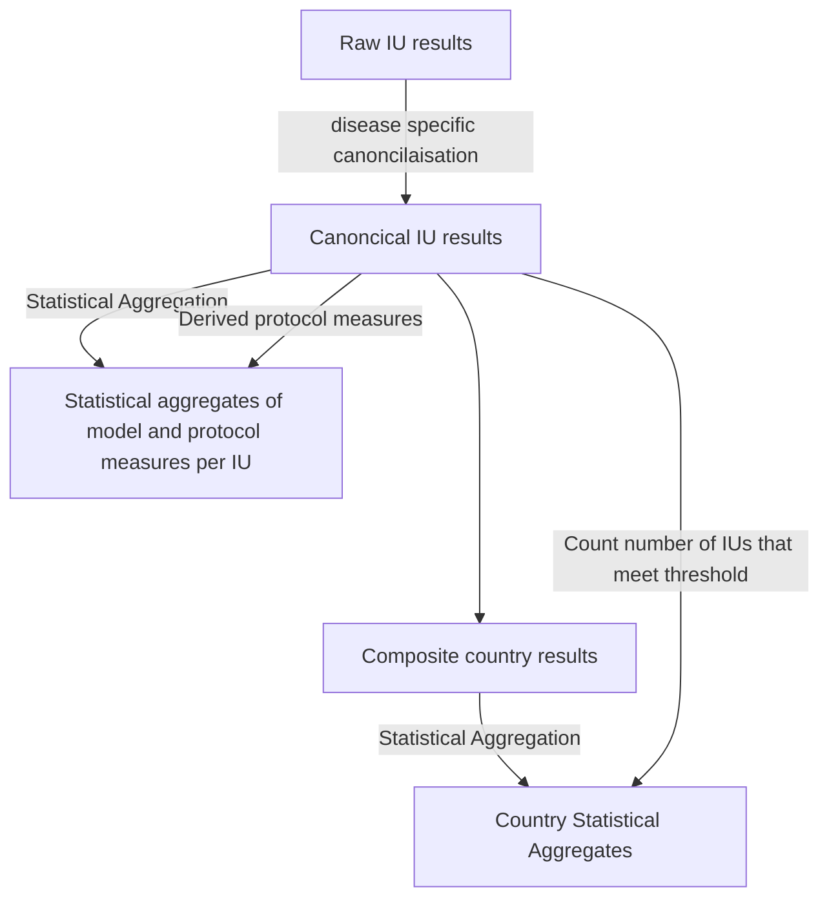

# endgame-postprocessing

## The Post Processing Pipeline

### Terminology

#### General
* **Processed prevalence** - the selected prevalence measure per model
* **Protocol passed** - whether the processed prevalence is below the disease specific threshold
* **Protocol Confidence** - the percentage of runs required to say the protocol has passed  
* **Model Measures** - the measures derived from the model, currently just processed prevalence
* **Protocol Measures** - the measures the post processing pipeline calculates, 
  currently each of the protocol confidence levels and whether enough simulations for that IU passed. 

#### File Types
* **Raw** - the format that comes out of the model, multiple draws, many measures, non-standard names, per IU
* **Canonical Results** - Consistent names of columns across diseases, only showing processed prevalence
* **IU statistical aggregates** - multiple draws condensed into mean, median and percentiles, with columns for each protocol confidence on whether for that year the IU has passed the protocol
* **Composite Country Results** - the weighted assembling the draws for all the IUs still split out into multiple draws
* **Country statistical aggregates** - The composite draws for the country condensed into mean, median and percentiles, with columns for each protocol confidence whose values are _number_ of IUs that pass the protocol in the confidence percentage of runs.  



### The output specification:

#### Directory structure:

 - {disease}/
   - aggregated/
     - combined-{disease}-iu-lvl-agg.csv
     - [combined-{disease}-country-lvl-agg.csv](#per-country-file)
     - combined-{disease}-africa-lvl-agg.csv
   - ius/
     - [{scenario_N}\_{IU code}\_post_processed.csv](#per-iu--combined-iu-level-file-)
     - ... for each IU, for each scenario
   - iu_metadata.csv
 - ... for each disease

#### File Contents

##### Per IU / combined IU level file :

###### Columns

- scenario
- country_code
- iu_name
- year_id
- measure
- mean
- X_percentile [2.5%, 5%, 10%, 25%, 50%, 75%, 90%, 95%, 97.5%]
- standard_deviation
- median

###### Measures

* **processed_prevalence** - the prevalence measure for that disease
* **year_of_Xpct_runs_under_threshold** - the year X percentage of runs crossed the disease specific threshold

##### Per Country file:

###### Columns

- scenario
- country_code
- measure
- year_id
- mean - _the primary value for the measure (may not be a mean)_
- X_percentile [2.5%, 5%, 10%, 25%, 50%, 75%, 90%, 95%, 97.5%]
- standard_deviation
- median


###### Measures
- **processed_prevalence** - the composite prevalence in country (percentage taken using ?? as population)
- **number_of_ius_Xpct_under_threshold** - for each year, the number of IUs that in X percent of runs have gone under the threshold by this year
- **pct_modelled_ius_Xpct_under_threshold** - for each year, the percentage of IUs, out of those modelled, who in X percent of runs have gone under the threshold by this year
- **pct_endemic_ius_Xpct_under_threshold** - for each year, the percentage of IUs, out of those that are classified as endemic, who in X percent of runs have gone under the threshold by this year
- **year_X_pct_runs_in_all_ius** - the year in X percent of runs all IUs have crossed the threshold. If any IU has not reached the threshold in X percent of runs, this will be -1. Note: column year_id will be n/a for this.


## Tests

To run the tests for this repo run:

```
poetry run pytest
```

These are automatically run in CI.

### End to end tests

There exists end to end tests for the model post processing pipelines (currently just LF). 

They use a fixed input to generate a consistent set of outputs. 

If you are expecting the change, you can update them by running

```
poetry run pytest --snapshot-update
```

This will modify the files in the `known_good_output` directory. 
Verify the new data looks to have changed in the way you are expecting, 
and if it does then check it in. 
